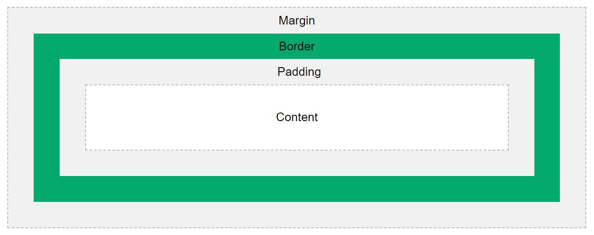
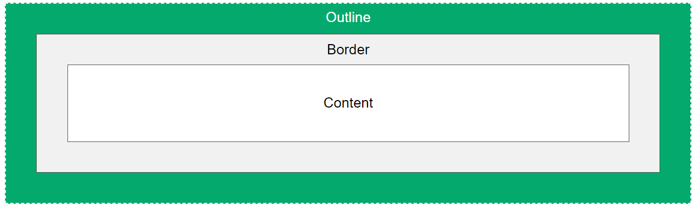

### CSS Selectors  
| Selector | Example | Description |   
| ------- | -------| ---------|  
| #id | #firstname | selects all element with id="firstname" |  
| .class | .intro | selects all element with class="intro" |  
| element.class | p.intro | selects ```p``` elements with class="intro" |  
| * | * | select all element |  
| element | p | select all ```p``` element |  
| element, element,... | p, div | select all ```p``` and ```div``` element |  

### How to add CSS  
- External CSS : ```<link rel="stylesheet" href="mystyle.css">```  
- Internal CSS : ```<style> all css style here</style>```  
- Inline CSS : ```<element style="desired style" > content </element>```  

### Cascading Order  
- Inline style (inside an HTML element)
- External and internal style sheets (in the head section)
- Browser default

### CSS Comments  
```/*comment here*/```  

### CSS Colors  
```
h1{
    background-color: lightblue; /*background color*/
    color: red; /*text color*/
    border: green; /*border color*/
}
```  
Color adding format:
```
    rgb(255, 99, 71),
    #ff6347,
    hsl(9, 100%, 64%),
    rgba(255, 99, 71, 0.5),
    hsla(9, 100%, 64%, 0.5)
```  
Color picker : https://www.w3schools.com/colors/colors_picker.asp  

### CSS Backgrounds  

- background-color: value;
- opacity: value; [value from 0.0 to 1.0]
- background-image: url(link_here);
- background-repeat: repeat-x; [or repeat-y or no-repeat]
- background-attachment: scroll/fixed/local/inherit/initial/revert/revert-layer/unset;
- background-position: value;
- background (shorthand property)

For example :  
```
    body{
        background-color: green;
        opacity: 0.3;
        background-image: url(paper.gif);
        background-repeat: repeat-y;
        background-attachment: fixed;
        background-position: right top;
    } 
    
    For shortand : 
    body{
        background: green url(paper.gif) repeat-y fixed right top;
    }
```  

### CSS Borders

- border-style: ``value``; [dotted/dashed/solid/double/groove/ridge/inset/outset/none/hidden]
- border-width: [``value``] or [``value`` ``value``] or [``value`` ``value`` ``value`` ``value``]
- border-color: [``value``] or [``value`` ``value``] or [``value`` ``value`` ``value`` ``value``]
- border-top-style: dotted;
- border-right-style: solid;
- border-bottom-style: dotted;
- border-left-style: solid;
- border-radius: value;
For example : 
```
    h1{
        border-style: dashed;
        border-width: 5px;
        //border-width: 5px 6px;
        border-radius: 2px;
    }
```  

### CSS Margins  

- margin-top
- margin-right
- margin-bottom
- margin-left
<!-- All the margin properties can have the following values:

auto - the browser calculates the margin
length - specifies a margin in px, pt, cm, etc.
% - specifies a margin in % of the width of the containing element
inherit - specifies that the margin should be inherited from the parent element -->

```
    selector{
        margin: value;(all sides)
    }
    selector{
        margin: value(top) value(right) value(bottom) value(left);
    }
    selector{
        margin: value(top) value(left-right) value(bottom);
    }
    selector{
        margin: value(top-bottom) value(left-right);
    }
    selector{
        marfin: auto;
    }

```  

### CSS Padding  
- padding-top
- padding-right
- padding-bottom
- padding-left  

```
    selector{
        padding: value;(all sides)
    }
    selector{
        padding: value(top) value(right) value(bottom) value(left);
    }
    selector{
        padding: value(top) value(left-right) value(bottom);
    }
    selector{
        padding: value(top-bottom) value(left-right);
    }
    selector{
        marfin: auto;
    }

```  

### CSS Height and Width  
- height: value;
- width: value;
- max-width: value;  

<!-- The height and width properties may have the following values:

auto - This is default. The browser calculates the height and width
length - Defines the height/width in px, cm, etc.
% - Defines the height/width in percent of the containing block
initial - Sets the height/width to its default value
inherit - The height/width will be inherited from its parent value -->  

### CSS Box Model  
  

- Content - The content of the box, where text and images appear
- Padding - Clears an area around the content. The padding is transparent
- Border - A border that goes around the padding and content
- Margin - Clears an area outside the border. The margin is transparent
- The box model allows us to add a border around elements, and to define space between elements.  

### CSS Outline
  

- outline-style: ``value``; [dotted/dashed/solid/double/groove/ridge/inset/outset/none/hidden]
- outline-width: thin/medium/thick/value;
- outline-color: [``value``] 
- outline-offset: [```value```]  

### CSS Text
- color: value;
- text-align: left/right/center/justify;
- text-align-last: left/right/center/justify;
- direction: rtl/ltr;
- vertical-align: baseline/text-top/text-bottom/sub/super;
- text-decoration-line: overline/underline/line-through/overline underline;
- text-decoration-color: value;
- text-decoration-style: value;
- text-decoration-thickness: value;
- text-transform: uppercase/lowercase/capitalize;
- text-indent: value;
- letter-spacing: value;
- line-height: value;
- word-spacing: value;
- white-space: 
- text-shadow: 

```
    selector{
        color: red;
        text-align: justify;
        direction: ltr;
        text-indent: 50px;
    }

    //to remove hyperlinek's underline
    a{
        text-decoration: none;
    }
```  

### CSS Fonts
- font-family: 
- font-style: normal/italic/oblique;
- font-weight: normal/lighter/bold/900;
- font-variant: normla/small-caps;
- font-size: 16px/1em/100%/10vw;
- font shorthand

```
    selector{
        font-familty: "Times New Roman", Times, serif;
        font-style: normal;
        font-weight: bold;
        font-size: 10vw;
    }
```  

<!-- ### CSS Icons   -->

### CSS Links  

The four links states are:
- a:link - a normal, unvisited link
- a:visited - a link the user has visited
- a:hover - a link when the user mouses over it
- a:active - a link the moment it is clicked

**Note :**When setting the style for several link states, there are some order rules:

- a:hover MUST come after a:link and a:visited
- a:active MUST come after a:hover

```
    a:link{
        color: red;
        text-decoration: none;
    }
    a:visited{
        color: green;
        text-decoration: none;
    }
    a:hover{
        color: hotpink;
        text-decoration: underline;
    }
    a:active{
        color: blue;
        text-decoration: underline;
    }
```  

**Note :** See cursor property  

### CSS Lists  
In HTML, there are two main types of lists:

- unordered lists (```<ul>```) - the list items are marked with bullets
- ordered lists (```<ol>```) - the list items are marked with numbers or letters  

The CSS list properties allow you to:

- Set different list item markers for ordered lists
- Set different list item markers for unordered lists
- Set an image as the list item marker
- Add background colors to lists and list items

list property: 
- list-style-type
- list-style-image
- list-style-position: inside/outside;
- 
```
    list_selector{
        list-style-type: circle;
        list-style-position: inside;
    }

    // To remove list's Default Settings
    list_selector {
        list-style-type: none;
        margin: 0;
        padding: 0;
    }

```  

### CSS Tables

- border:
- width:
- border-collapse:
- height:
- width:
- text-align:
- vertical-align: 
- padding:
- border-bottom:
- :hover
- :nth-child(even/odd)

For responsive table: 
- overflow-x:auto;

```
    table/th/tr/td/#tableid/.tableclass{
        border: 1px solid;
        border-collapse: collapse;
        text-align: center;
        padding: 8px;
    }
    tr:nth-child(even){
        background-color: #f2f2f2;
    }
    tr:hover{
        background-color: coral;
    }

    For responsive table: 
    <div style="overflow-x:auto;">
        <table>
            ...
            ...
        </table>
    </div>
```  
